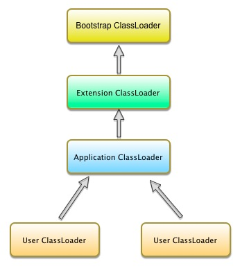

# Java ClassLoader理解
###什么是ClassLoader
&emsp;&emsp;我们都知道，当我们写好一个JAVA程序后，不管是我们自己手动通过javac编译，还是通过IDE开发自动编译，我们写的.java文件会最终生成一堆.class文件。当JVM要执行我们所写的程序时，其实就是要解析并执行这些.class文件。  
&emsp;&emsp;首先JVM会找到程序的入口类，一般即拥有public static void main(String[] args)这个类，因为要执行main方法，所以要先要加载这个方法所在的.class文件，然后在后续过程中“按需加载”———加载main方法所在类的class文件时以及执行main方法过程所需要用到其他的class文件。这些class文件会通过JVM的ClassLoader加载到JVM内存并且在JVM的方法区中每一个加载的class文件会对应一个Class对象，这个Class对象实际上是某个class文件在JVM中一种runtime表现，它包含着某个class所有的元数据，并作为方法区这个类各种数据的访问入口。  
&emsp;&emsp;综上所述，class文件从读取(硬盘文件或者字节流、网络)进入到JVM的内存并创建对应的Class对象的过程称之为“类加载”，那么负责完成这个过程的工具就叫做“ClassLoader”。

###ClassLoader种类
**JVM默认提供的ClassLoader:**  
**1. Bootstrap ClassLoader(启动类加载器)**  
&emsp;&emsp;这个类加载器负责将存放在$JAVA_HOME/lib目录中的，或者被—Xbootclasspath参数所指定的路径中的，并且是JVM识别的类库记载到JVM内存中。  
**2. Extension ClassLoader(扩展类加载器)**  
&emsp;&emsp;这个类加载器由sun.misc.Launcher$ExtClassLoader实现，它负责加载$JAVA_HOME/lib/ext目录中，或者被java.ext.dirs系统变量所指定的路径中的所有类库。  
**3.Applicaiton ClassLoader(应用程序类加载器)**  
&emsp;&emsp;这个类加载器由sun.misc.Launcher$AppClassLoader实现。这个类加载可以由ClassLoader的getSystemClassLoader()方法获得，所以这个类加载器也可以称为系统类加载器。它负责加载用户类路径即我们配置环境环境变量时CLASSPATH上所指定的类库，我们可以在应用程序中使用这个类加载器，如果我们在开发应用程序中没有自定义自己的类加载器，那么一般情况下这个就是程序默认的类加载器。  
ps:我们还可以
###ClassLoader加载机制
**双亲委派模型**  
&emsp;&emsp;在我们应用程序在实际启动和运行过程中，JVM是使用上面介绍的三种类加载器以及用户自定义的类加载器来相互配合使用进行加载的。这些类加载器的关系如下图:  
  
上图这种类加载器之间的层次关系叫做双亲委派模型(Parents Delegation Model).双亲委派模型除了顶层的Bootstrap ClassLoader以外，其余的ClassLoader都有自己的父类加载器。注意：这里类加载器之间的父子关系不是继承关系，而是以组合关系来实现的，即除顶层的BootStrap ClassLoader以外，其他的子ClassLoader都有一个属性parent引用指向上一个ClassLoader,我们可以看类ClassLoader的代码:  
```java   
public abstract class ClassLoader {
    // The parent class loader for delegation
    // Note: VM hardcoded the offset of this field, thus all new fields
    // must be added *after* it.
    private final ClassLoader parent;
    ...
 ```
 在继承ClassLoader类实现自己的自定义ClassLoader时，如果给parent属性赋值则默认是AppClassLoader,我们来看ClassLoader默认构造函数:
```java
  ...
  protected ClassLoader() {
        this(checkCreateClassLoader(), getSystemClassLoader());
    }
  ...
```
**使用双亲委派模型的类搜索/加载机制**  
&emsp;&emsp;当JVM请求某个ClassLoader实例使用这种模型来加载类时，   
```java
  ...
  protected Class<?> loadClass(String name, boolean resolve)
        throws ClassNotFoundException
    {
        synchronized (getClassLoadingLock(name)) {
            //首先检查class是否已经被加载
            Class c = findLoadedClass(name);
            if (c == null) {
                long t0 = System.nanoTime();
                try {
                    //如果class没有被加载且已经设置parent,那么请求其父加载器加载
                    if (parent != null) {
                        c = parent.loadClass(name, false);
                    } else {
                      //如果没有parent类加载器，则寻找BootstrapClss并尝试使用Boot loader加载
                        c = findBootstrapClassOrNull(name);
                    }
                } catch (ClassNotFoundException e) {
                    // ClassNotFoundException thrown if class not found
                    // from the non-null parent class loader
                }

                /**
                 *如果当前这个loader所有的父加载器以及顶层的Bootstrap ClassLoader都不能加载待加载的类
                 *那么则调用自己的findClass()方法来加载
                 */                
                if (c == null) {
                    // If still not found, then invoke findClass in order
                    // to find the class.
                    long t1 = System.nanoTime();
                    c = findClass(name);

                    // this is the defining class loader; record the stats
                    sun.misc.PerfCounter.getParentDelegationTime().addTime(t1 - t0);
                    sun.misc.PerfCounter.getFindClassTime().addElapsedTimeFrom(t1);
                    sun.misc.PerfCounter.getFindClasses().increment();
                }
            }
            if (resolve) {
                resolveClass(c);
            }
            return c;
        }
    }
    
    //该方法实现默认是抛出异常，需要用户自己实现
    protected Class<?> findClass(String name) throws ClassNotFoundException {
        throw new ClassNotFoundException(name);
    }
  ...
```
**为什么要使用双亲委托模型?**


###自定义ClassLoader
**为什么我们需要自定义类加载**